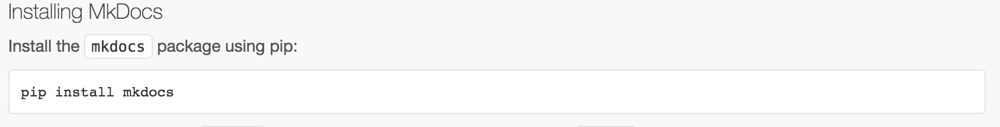

START HIER MET LEZEN


Aan de docent:


Zoals besproken hebben wij de documentatie, in markdown, beschreven.

- Statische Gebruikersvriendelijk Beroepsproduct

Wij gebruiken de tool 'mkdocs' om de:
  - markdown files te converteren naar html.
  - een statische webservertje te bouwen d.m.v. python

De reden dat wij dit besloten hebben is dat mijn partner en ik op verschillende Operating Systems werken. Hierdoor konden we niet met een geschikte grafische tekstverwerker (bv. OSx-Pages) samenwerken.

Markdown wat ervaring mee, en kwam toen de tool mkdocs tegen. Het enige wat je nodig hebt is python:

installatie:



now mkdocs is installed. We created a new mkdocs-filebase ```OOAD```. In the root of the OOAD folder there is an ```mkdocs.yml``` file. In there we added the pages of the static website.

2. run the static server

Run in the root of ```OOAD``` ```mkdocs serve```.

open: [localhost:8000](127.0.0.1:8000)
