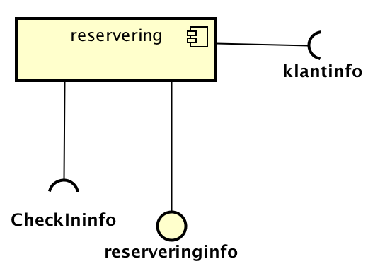
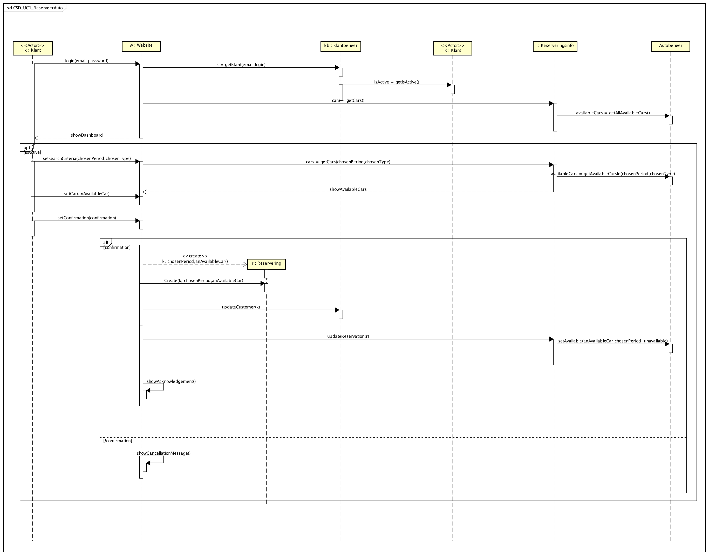
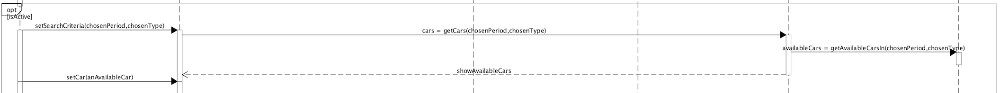
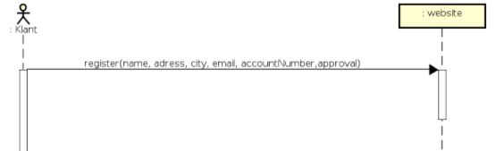

# Software Design Description

---

## Inhoudsopgave

<!-- TOC depthFrom:3 depthTo:4 withLinks:1 updateOnSave:1 orderedList:0 -->

- [Doel van dit document](#doel-van-dit-document)
	- [Component Diagram](#component-diagram)
	- [Overzicht van alle componenten](#overzicht-van-alle-componenten)
- [Detailed Design Description](#detailed-design-description)
	- [UC 1 Reserveringscomponent](#uc-1-reserveringscomponent)
	- [UC 2 Autocomponent](#uc-2-autocomponent)
	- [UC 3 Betalingscomponent](#uc-3-betalingscomponent)
	- [UC 4 Klantcomponent](#uc-4-klantcomponent)
	- [UC 5 Autobeheercomponent](#uc-5-autobeheercomponent)
- [Design Class Diagram](#design-class-diagram)

<!-- /TOC -->

---

## Introductie

De opdracht staat (kort) beschreven in het SRS. Om geen duplicate informatie te verstrekken, kunt u [naar de ```Introductie Opdracht```](SRS_v1-0-4.md#introductie-opdracht)  gaan.

---

### Doel van dit document

  - Software Architectuur in grote lijnen beschrijven a.d.h.v. een componentdiagram.
  - Systeem operaties over de individuele componenten beschrijven a.d.h.v. Component Sequence Diagrams.
  - Een vertaling maken van concepten in het probleem(/opdracht)-domein naar code-concept a.d.h.v. een Design Class Diagram
  - 'Gedrag' van het systeem beschrijven a.d.h.v. andere interactie-diagrams zoals Activity diagrams en een statemachine.
  - Gemaakte keuzes in het ontwerp beargumenteren en verantwoorden.

---


#### Component Diagram

**Iteratie 1**


[Path to image : Component_Diagram_v1-0-1](assets/Component_Diagram_v1-0-0.png)

**Iteratie 2**


[Path to image : Component_Diagram_v1-0-2](newDiagrams/png/CD_RendIt.png)

---

#### Overzicht van alle componenten

```
* Provided Interface
* * required Interface
```

| Component       | * Provided       | ** Required                |           Component image with interfaces            |
|-----------------|-------------|----------------------|:----------------------------------------------------:|
| auto            | RitInfo          |                            |  |
| autobeheer      | CheckInInfo      | ritInfo,  reserveringsinfo |  |
| reservering     | reserveringsinfo | CheckInInfo, klantInfo     |  |
| webapp          | webInfo          |                            |  |
| klant           | klantInfo        | webInfo, betalingsInfo      |  |
| betalingsdienst | betalingsInfo    |                            |  |

---

---

### Detailed Design Description


Hieronder worden de verschillende onderdelen verder uitgelegd.

Om de beschrijvingen structuur te geven hanteren  bespreken we de onderdelen in hoofdlijn over de Use Cases. Hierbij geldt dat het soms relevant kan zijn om uit te wijden over ook andere onderdelen. Hierdoor kan overlap ontstaan.


```
Detailed Design Descriptions Format

* korte beschrijving van de koppeling tussen:
  - De Use Case.
  - Het ontworpen component.
* Een component Sequence Diagram
* Eventueel een Activity Diagram
* Ontwerpbeslissingen met eventuele Design Patterns.

```

#### Overzicht keuze type diagram

|  UseCase-Code  | SSD | CSD | AD  | SM  |     |
|:--------------:|:---:|:---:|:---:|:---:| --- |
|      UC-1      |  X  |  X  |     |     |     |
|      UC-2      |  X  |  X  |  X  |  X  |     |
|      UC-3      |  X  |  X  |     |     |     |
| UC-4  (*CRUD)  |  X  |  X  |     |     |     |
| UC-5   (*CRUD) |     |     |  X  |     |     |

*CRUD = Create Read Update Delete

---

---

#### UC 1 Reserveringscomponent

##### Short description

Het reserveren van een auto bestaat uit grofweg 3 hoofd-onderdelen:

1. Inloggen en verificatie van de klant.
2. Criteria aangeven voor het huren van een huurauto
3. Bevestigen van de reservering, praktische informatie verschaffen.

##### Component Sequence Diagram **Iteratie 1**


[Path to image : CSD_UC1_reserverenAuto_iteratie1](assets/markdown-img-paste-20171031040223576.png)


##### Component Sequence Diagram **Iteratie 2**



[Path to image : CSD_UC1_rserveerauto_iteratie2](newDiagrams/png/CSD_UC1_ReserveerAuto.png)

##### Design decisions

**Inloggen en verificatie van de klant.**


**Criteria aangeven voor het huren van een huurauto**


**Bevestigen en praktische informatie**


---

#### UC 2 Autocomponent

##### Short description

Het gebruiken van een auto bestaat 3 hoofd-onderdelen:

1. Openen van een auto a.d.h.v. verificatie op de reservering

2. Het maken van 1 of meer ritten tijdens de huurperiode

3. Het doorvoeren van de gemaakte ritten na de huurperiode.

Om de flow van  activiteiten extra te verduidelijken hebben we voor deze Use Case ook een activity diagram gemaakt.

##### Activity Diagram


[Path to image : AD_Gebruik_Auto_iteratie_2](newDiagrams/png/AD_UC2_GebruikAuto.png)

##### Component Sequence Diagram **Iteratie 1**


[Path to image : CSD_UC2-gebruikAuto_iteratie_1](assets/CSD_UC2-gebruikAuto_v1-0-0.png)

##### Component Sequence Diagram **Iteratie 2**


[Path to image : CSD_UC2-gebruikAuto_iteratie_2](newDiagrams/png/CSD_UC2_GebruikAuto.png)

##### State Machine Diagram


##### Design decisions

**Openen van een auto a.d.h.v. verificatie op de reservering**


**Het maken van 1 of meer ritten tijdens de huurperiode**


**Het doorvoeren van de gemaakte ritten na de huurperiode.**


**Toevoegen van een boete**


---

---

#### UC 3 Betalingscomponent

##### Short description

Het betalen van een gehuurde auto gebeurt, zoals vaker benoemd, via een automatische afschrijving.

We hebben tijdens de eerste iteratie een gesteld dat het betalingssyteem actief 'vraagt' aan RedCars welke betalingen vericht moeten worden.
Tijdens de tweede iteratie hebben we de actor betalingssyteem veranderd naar van primair naar secundair. Daarbij hebben we tijd als primaire actor toegevoegd (zie [toelichting SRS](SRS_v1-0-4.md#3_3-uc3-betalen))

##### Component Sequence Diagram


[Path to image : CSD_UC3_Betalen_iteratie_2](newDiagrams/png/CSD_UC3_Betalen.png)


##### Design decisions

** Van tijd naar betalingsdienst**

De abstracte actor Tijd triggert de betalingsdienst. De betalingsdienst vraagt aan het Reserveringsinfo component om de volledige betaling te berekenen.


**Facade Controller**

Wij hebben voor de functionaliteit van het betalingscomponent een probleem opgelost door middel van een Design Pattern. Wij liepen er tegen aan dat het betalingscomponent, na het gebruik van de auto, het totaalbedrag moet weten. Om ervoor te zorgen dat we geen ```Hogere Coupling``` en ```Lagere Cohesie``` zouden krijgen door het betalingscomponent direct verbinding te laten leggen met de benodigde onderdelen om het totaal bedrag uit te rekenen.

Hierdoor hebben we een 'pure artificial' component bedacht, reserveringsinfo. Dit component is de brug tussen het betalingssysteem en de andere componenten (zie onderstaande afbeelding).


---


#### UC 4 Klantcomponent

##### Short description

Het klant component wordt gebruikt om klanten mee te beheren.


##### Component Sequence Diagram Create


[Path to image : CSD_UC4_BeheerKlant_Create](newDiagrams/png/CSD_UC4_BeheerKlant_Create.png)

##### Design decisions

happy flow



Toevoegen nieuwe klant aan systeem en controle op uniek account.


---

##### Component Sequence Diagram Read


[Path to image : CSD_UC4_BeheerKlant_Read](newDiagrams/png/CSD_UC4_BeheerKlant_Read.png)

---

##### Component Sequence Diagram Update


[Path to image : CSD_UC4_BeheerKlant_Update](newDiagrams/png/CSD_UC4_BeheerKlant_Update.png)

---

##### Component Sequence Diagram Delete


[Path to image : CSD_UC4_BeheerKlant_Delete](newDiagrams/png/CSD_UC4_BeheerKlant_Delete.png)

---

---

#### UC 5 Autobeheercomponent

##### Short description

Onderstaande activity diagrams beschrijven de flow van het beheren van een auto.

##### Activity Diagram Create


[AD_UC5_BeheerAuto_Create](newDiagrams/png/AD_UC5_BeheerAuto_Create.png)

##### Activity Diagram Read


[AD_UC5_BeheerAuto_Read](newDiagrams/png/AD_UC5_BeheerAuto_Read.png)

##### Activity Diagram Update


[AD_UC5_BeheerAuto_update](newDiagrams/png/AD_UC5_BeheerAuto_Update.png)


##### Activity Diagram Delete


[AD_UC5_BeheerAuto_Delete](newDiagrams/png/AD_UC5_BeheerAuto_Delete.png)


### Design Class Diagram


[Path to image : Design Class Diagram_iteratie_2](newDiagrams/png/DCD_RendIt.png)

---
