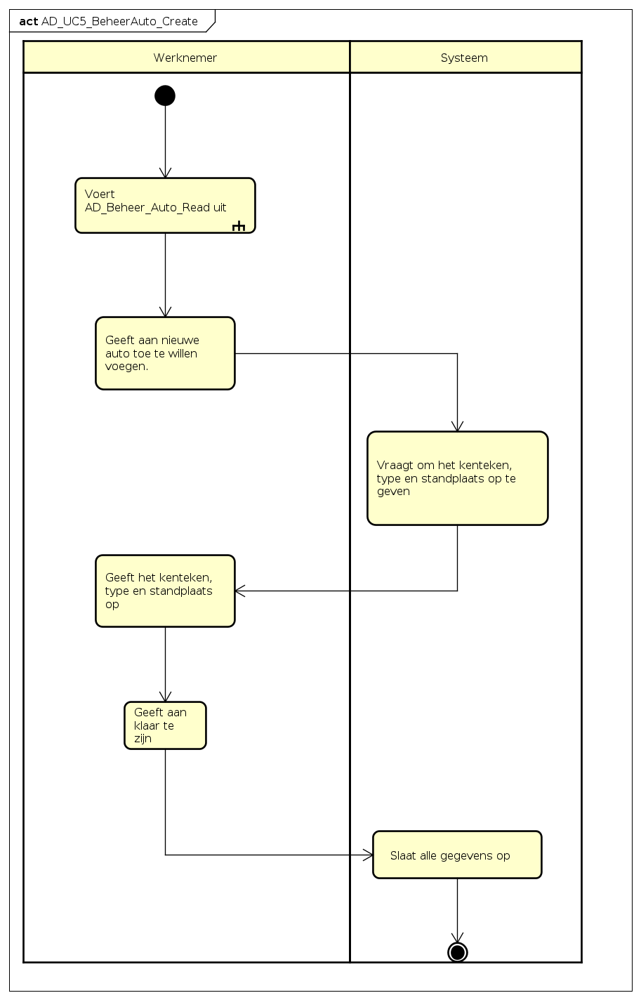

# Software Requirements Specification

---

<!---
## Revision History

| Version | Date        |                                              Description                                              | Author |
|---------|-------------|:-----------------------------------------------------------------------------------------------------:|--------|
| v1.0.0  | 30/10/2017  |                                  Converted SRS template to markdown                                   | JOB    |
| v1.0.1  | 30/10/2017  |                                added basic template to file. (header )                                | JOB    |
| v1.0.2  | 31 /10/2017 |                                       Customized Inhoudsopgave                                        | JOB    |
| v1.0.3  | 31/10/2017  |                            Deleted obsolete information and cleaned markup                            | JOB    |
| v1.0.4   | 01/11/2017  | Wrote descriptions for Actor-goal list and for the include and extend relations in the use case model | JOB    |
|        |             |                                                                                                       |        |

-->

<a name="top"></a>

## Inhoudsopgave

<!-- TOC depthFrom:3 depthTo:4 withLinks:1 updateOnSave:0 orderedList:0 -->

- [1. Introductie opdracht](#1-introductie-opdracht)
	- [De doelstelling van RedCars](#1_1-de-doelstelling-van-redcars)
-[2. UseCase Model](#)
- [2.1 UseCase Diagram](#2_1-usecase-diagram)
	- [2.1.1 Extend relatie](#2_1_1-extend-relatie)
	- [2.1.2 Include relatie](#2_1_2-include-relatie)
	- [2.2 Actor-goal list](#2_2-actor-goal-list)
- [3 Overzicht Use Case's](#3_0-overzicht-use-cases)
	- [3.1 UC1: reserveer auto](#3_1-uc1-reserveer-auto)
	- [3.2 UC2: gebruik auto](#3_2-uc2-gebruik-auto)
	- [3.3 UC3: betalen](#3_3-uc3-betalen)
	- [3.4 UC4: beheer klant](#3_4-uc4-beheer-klant)
		- [3.4.1 UC4.1-Create](#3_4_1-uc41-create)
		- [3.4.2 UC4.2-Read](#3_4_2-uc42-read)
		- [3.4.3 UC4.3-Update](#3_4_3-uc43-update)
		- [3.4.4 UC4.4-Delete](#3_4_4-uc44-delete)
	- [3.5 UC5: beheer auto](#3_5-uc5-beheer-auto)
- [4 Domain model](#4-Domain-model)
- [5 Supplementary_Specification](#5-suplementary-specification)
	- [5.1 Functional](#5_1-functional)
	- [5.2 Usability](#5_2-usability)
	- [5.3 Reliability](#5_3-reliability)
	- [5.4 Performance](#5_4-performance)
	- [5.5 Supportability](#5_5-supportability)

---


### 1 Introductie opdracht

Wij voeren de casus uit voor autoverhuurbedrijf RentIt. Zij willen een nieuwe service gaan aanbieden, namelijk het verhuren van deelauto's.  


Het doel van dit document is om op gestructureerde wijze een analyse te verkrijgen van het gevraagde systeem.
Waarna in het [Software Design Description](SDD_v1-0-1.md#purpose-of-this-document) een ontwerp beschreven staat voor dit systeem. In dit document beschrijven wij de meest actuele versie van deze analyse.


#### 1_1 De doelstelling van RedCars

Wij willen een autoverhuur service aanbieden, waarbij de vraag naar auto's bepaald waar de auto's gestationeerd worden. Nu gebeurt dit met name gecentraliseerd, vanuit een specifieke locatie.

Voor dit probleem is ons gevraagd een analyse en ontwerp te realiseren.

---

---

## 2 Use Case Model

---

### 2_1 UseCase Diagram

In het Use Case diagram staan de mogelijke acties onderverdeeld in Use cases. Hierbij is aangegeven welke actoren welke acties op het systeem kunnen uitvoeren. Elke use case heeft waarde voor de opdrachtgever en levert een zichtbaar resultaat op.

- Use case 1 tot en met 3 hebben betrekking op acties die klanten op het systeem doen.

- Use Case 4 en 5 hebben betrekking op werknemers van RedCars. Use Case 4 en 5 zijn CRUD use cases. Dit staat voor Create, Read, Update en Delete. Zoals de naamgeving doet vermoeden hebben deze UseCases betrekking op het beheren van informatie.


---

#### 2_1_1 Extend relatie


```UC1-reserveerAuto <<extends>> UC2-gebruikAuto```

* De extend relatie tussen UC1 en UC2 hebben wij geplaatst omdat zonder deze extend, UC2-gebruikAuto ook uitgevoerd kan worden (volgens het Use Case Diagram) zonder dat er eerst een reservering is gedaan door een klant.

* Daarnaast kan je een auto reserveren maar is dat niet in 100% van de gevallen garantie voor het gebruiken van de auto.

---

#### 2_1_2 Include relatie


```UC2-gebruikAuto <<include>> UC3-betalen```

* Het gebruiken van een auto leidt altijd tot een betaling, waarna vervolgens opnieuw een auto gereserveerd mag worden. Mocht de automatische afschrijving niet slagen dan kan er geen nieuwe reservering geplaatst worden. Door deze sterke relatie en ook afhankelijkheid hebben we de include relatie toegepast.

```
Opmerking: wij hebben ook overwogen om nog een include relatie, toe te voegen tussen UC1-reserveerAuto en UC3-betalen. Omdat na een reservering altijd een betaling volgt ookal wordt UC2-gebruikAuto niet uitgevoerd.
```
---

---

#### 2_2 Actor-goal list

AA. | Actor            | Beschrijving
----|------------------|--------------------------------------------------------------------------------------------------------------------------------------------------------------
1   | Klant            | Wil een dienst afnemen bij RedCars autoverhuur. Hierbij wil de klant een keuze aanbod hebben om binnen een gekozen tijdsbestek een auto naar keuze te kunnen huren.
2   | Medewerker       | Wil zijn taken als medewerker correct, snel en met gemak kunnen uitvoeren.
3   | Tijd             | Tijd is volgens onze analyse de primaire actor voor de UC3-betalen. Er wordt namelijk een automatisch afschrijving uitgevoerd. Weliswaar door een externe dienst, ```toch is tijd 'degene' die de trigger zal moeten geven om de betaling af te schrijven```. De kosten voor het huren van een wagen, kunnen pas nadat een klant heeft uitgecheckt, bepaald worden (**huurbedrag + kilometerkosten + evt. boete**)
4   | Betalingsdienst | Het betalingsdienst is volgens onze analyse een secundaire actor. Uiteraard zal deze externe partij betalingen voor hun klanten (in ons geval RedCars) correct willen regelen. Voor onze situatie levert het betalingsdienst een dienst aan ons systeem.
5   | RedCars Management             | Deze actor komt niet expliciet voor in ons usecase diagram. Om diverse redenen zou je deze actor, zeker voor een 'echte' opdrachtgever, kunnen opnemen in use cases. M.b.t. dit beroepsproduct hebben wij ervoor gekozen om deze actor niet actief te beschrijven.

```Opmerking: De beschrijving bevat wishful thinking. De kerntaken hebben in overleg met onze docent besproken. De rest hebben we aangevuld met, volgens ons, algemeen aanvaardbare omschrijvingen. ```

---

---

## 3 Use Case Descriptions

Hieronder worden de alle noodzakelijke use cases beschreven.

Bij elke uitwerking van een use case hebben wij een vast formaat gehanteerd waardoor wij denken dat we bijdragen aan positieve traceability tussen de onderdelen in de analyse en het design.

```
Use Case Descriptions Format

* De brief-description.
* Een afbeelding van het bijbehorende System Sequence Diagram.
* De Fully-Dressed Use Case description.
* Een link naar de Software Design Description, met daarin beschreven systeemoperaties.
* Een link naar de bijbehorende Component Sequence Diagram in het SDD.
```
---

### 3_0 Overzicht Use Case's

Wij hebben ervoor gekozen om de volgende 5 hoofd-functionaliteiten te vertalen naar Use Cases.

```Opmerking; wij hebben in overleg met de docent alle __brief-descriptions__ alszijnde een specifiek scenario, met een happy ending geschreven.```

Ons is gevraagd om minimaal 1 CRUD Use Case uit te werken in onze analyse en design. Wij hebben ervoor gekozen 2 CRUD UseCases uit te werken en deze op twee verschillende manieren te modeleren. Dit hebben wij gedaan omdat wij het interessant vonden om andere modellen te gebruiken voor eenzelfde probleemstelling.


[Meer informatie over de uitgewerkte diagrammen in het SDD](SDD_v1-0-1.md#overzicht-keuze-type-diagram)

---

---

[ [UC1-reserveerAuto](#3_1-uc1-reserveer-auto) ] [ [uc2-gebruik-auto](#3_2-uc3-gebruik-auto) ] [ [UC3-betalen](#3_3-uc3-betalen) ] [ [UC4-beheerKlant](#3_4-uc4-beheer-klant) ]  [ [UC5: beheer auto](#3_5-uc5-beheer-auto) ]

---

### 3_1 UC1: reserveer auto


##### Brief-description

De klant wil een stationwagen huren voor een periode van een week.
De klant logt in op het systeem. Het systeem toont alle beschikbare autos.
De klant zoekt een beschikbare stationwagen bij de klant in de buurt, voor de volgende week.
Systeem toont beschikbare stationwagens, bij hem in de buurt, voor die periode.
De klant maakt hieruit een keuze
Het systeem stuurt een bevestiging.

##### System Sequence Diagram


[Path to image : SSD_UC1_reserveerAuto_v1-0-0](assets/SSD_UC1_reserveerAuto_v1-0-1.png)

##### Systeemoperaties

Het SSD heeft twee 'calls' op het systeem, die belangrijk zijn om de Use Case uit te voeren:

1. login (email, password) <br>
	a. Het emailadres en wachtwoord zijn pas beschikbaar nadat de klant succesvol is aangemeld. Het wachtwoord is namelijk het nummer van de pas, die opgestuurd is als de klant volledig is aangemeld.
2. makeReservation(rentalPeriod, car)

##### Fully-dressed Description

```
** Info:**

- Primary actor: Klant
- Stakeholders and interests:
- Precondities:
	- De klant heeft een account bij RentIt
	- De klant heeft een pas thuisgestuurd gekregen.
	- De klant heeft geen betalingsachterstand bij RentIt
- Postcondities:
	- De klant heeft een bevestiging ontvangen met daarin:
	- de huurperiode( van-datum -- tot-datum).
	- De kale prijs van dze huurperiode (exlusief gereden kilometers en evt. boete).
	- Informatie over de gehuurde auto (bv het kenteken).
	- De standplaats waar de klant de auto op kan halen.
```

```
** Basic flow: **

1. De klant logt in op de website met zijn emailadres en pasnummer.
2. Het systeem kijkt of de klant een betalingsachterstand heeft.
3. [__Nee__] De website geeft alle auto's en hun beschikbaarheid en standplaats weer.
4. De klant geeft aan in welke stad hij de auto wil ophalen.
5. [__1 of meer autos beschikbaar__] De website geeft alle beschikbare auto's in deze stad weer.
6. De klant kiest een periode waarin hij/zij de auto wil gebruiken.
7. [__1 of meer auto's beschikbaar__] Het systeem toont alle autos in die periode.
8. De klant kiest het gewenste type auto.
9. [__1 of meer auto's beschikbaar__] Het systeem toont alle auto's van het gekozen type.  
10. De klant kiest een auto.
11. Het systeem toont voor de gekozen instellingen de prijs zonder- en met abbonoment.  
12. De klant kiest een van de twee opties.
13. De website geeft een bevestiging van de reservering.
```

```
**Alternative flow:**

- 3.a. [Ja] Het systeem toont een melding dat de betaling eerst voldaan moet zijn voordat de klant een nieuwe reservering mag plaatsen.
- 5.a. [Er zijn geen autos beschikbaar in deze stad] Systeem toont melding en evt. optie om auto in andere stad te huren.
- 7.a. [Er zijn geen autos beschikbaar in de gekozen periode] Systeem toont melding en evt. optie voor andere periode.
- 9.a. [Er zijn geen autos van dit type beschikbaar] Systeem toont melding en evt. om auto van ander type te huren.
```

---

---

| [naar boven](#top) |

---

### 3_2 UC2: gebruik auto


##### Brief-description

De klant wil zijn gehuurde auto gebruiken.
De klant checkt in.
De klant opent de auto met zijn pasje en start de auto.
Het systeem registreert de starttijd van de rit.
De klant rijdt naar een bestemming.
Het systeem registreert de eindtijd van de rit.
De klant zet de auto uit.
Het systeem checkt of de huidige locatie de standplaats is,
in dat geval wordt dit geregistreerd en geeft de mogelijkheid aan de klant om uit te checken.
De klant checkt uit.
De klant is wedergekeerd op de standplaats en doet de auto op slot met zijn pasje.

##### System Sequence Diagram

[Path to image : SSD_UC2-gebruikAuto](assets/SSD_UC2_gebruikAuto_v1-0-2.png)

##### Systeemoperaties

Deze SSD heeft 4 belangrijke 'calls' op het systeem:

1. checkin(cardnr) <br>
	a. de klant moet inchecken met zijn kaart om de auto te kunnen (en mogen) gebruiken.  <br>
	b. het systeem moet dan kijken of de klant gemachtigd is om de auto te openen <br>
2. startCar() <br>
	a. de tweede en derde 'calls' staan in een loop. De reden hiervoor is dat de auto gebruikt kan worden door de klant, zolang deze niet weer op de standplaats gezet wordt.  <br>
3. stopCar() <br>
	a. Na het stoppen van de auto wordt gecheckt door het systeem of de auto op de standplaats staat.  <br>
4. checkout(cardnr)


##### Fully-dressed Description

```
**Info: **

* Primary actor:De klant
* Stakeholders and interests:
* Precondities:De klant heeft een auto gereserveerd. De klant is bij de auto.
* Postcondities:De klant is wedergekeerd op de standplaats van de auto.
```

```
**Basic flow:**

1. De klant checkt in.
2. Het systeem registreert wie welke auto gaat gebruiken.
3. De klant opent de auto.
4. De klant stapt in.
5. De klant start de auto.
6. Het systeem registreert de begintijd van de rit.
7. De klant rijdt naar zijn bestemming.
8. De klant stopt de auto.
9. Het systeem registreert de eindtijd en het aantal gereden kilometers van de rit.
10. Het systeem controleert of de huidige locatie zijn standplaats is.
11. [Ja] Het systeem controleert of de reservering van deze klant is afgelopen.
12. [Ja] Het systeem geeft de mogelijkheid uit te checken.
13. De klant checkt uit.
14. Het systeem controleert of de klant te laat is
15. [Nee] Het systeem stuurt alle informatie op voor verwerking
```

```
**Alternative flow:**

* 11.a. [Nee] stappen 5 tot en met 11 worden uitgevoerd.
* 12.a. [Nee] Het systeem geeft een melding dat de reservering nog niet is afgelopen
Ga verder bij stap 4
* 14.a. [Ja] Het systeem registreert het aantal uren dat de auto te lang gebruikt is.
* 14.b. Het systeem stuurt alle informatie op voor verwerking inclusief de melding dat de auto te lang gebruikt is.
```

---

---

| [naar boven](#top) |

---

### 3_3 UC3: betalen

__De Use Case betalen is een zogenaamde 'core functionality'. Het hele business model van RedCars is zonder een betaling onmogelijk om op de huidige manier te realiseren. Vandaar dat gevraagd is deze Use Case prioriteit te geven in de eerste Iteratie, en in de tweede iteratie te verbeteren. Om dit proces te illustreren hebben we bij deze Use Case beide iteraties geillustreerd. De eerste uit iteratie 1 en de tweede uit iteratie 2.__


##### Brief-description Iteratie 1

Het betalingsinterface wil de rekening van de klant, die een abonnement gratis, station, per week abonnement en geen schulden heeft, afschrijven.
Het betalingsinterface vraagt aan het systeem of de klant buiten zijn gereserveerde periode is gegaan.
Het systeem geeft aan dat dit niet het geval is.
Het betalingsinterface vraagt aan het systeem welk abonnement de klant heeft.
Het systeem geeft aan dat de klant een gratis, stationwagen, per week abonnement heeft.
Het betalingsinterface berekent de huidige prijs voor de klant.
Het betalingsinterface vraagt hoeveel km de klant gereden heeft.
Het systeem geeft aan dat de klant 300 km heeft gereden.
Het betalingsinterface berekent opnieuw de huidige prijs.
Het betalingsinterface schrijft de rekening van de klant zijn rekening af.

##### System Sequence Diagram Iteratie 1


[Path to image : SSD_UC3-betalen](assets/SSD_UC3_Betalen_v1-0-0.png)

##### Brief-description Iteratie 2

Op het moment dat er een reservering wordt geplaatst, staat er een eindtijd in het systeem. RedCars levert een dienst met een 'contract', dat gaat buiten de scope van dit project. In dit contract staat (hoogstwaarschijnlijk) een termijn van bv. 5 werkdagen. Op de eindtijd van een specifieke reservering start dan deze termijn. Na verloop van tijd wordt dus de reservering getriggerd om tot betaling over te gaan.

##### System Sequence Diagram Iteratie 2


[Path to image : SSD_UC3-betalen](newDiagrams/SSD_UC3_Betalen.png)

##### Systeemoperaties

1. nextInvoice = getNextInvoice() <br>
	a. Er zit een kleine, maar belangrijke, nuance tussen de twee SSD's. Namelijk de actor die de Use Case initieert. In de eerste iteratie hebben we gesteld dat de (externe-)betalingsdienst, actief zou vragen aan het systeem of er rekeningen zouden zijn die betaald moesten worden. Dit leek ons al geen ideale oplossingen, maar we wisten op dat moment geen betere oplossing. In de tweede iteratie hebben we een abstracte actor toegevoegd: 'tijd'. Dit is volgens ons de meest logische oplossing. De transitie na het gebruik van een auto naar het betalen, gebeurd namelijk alleen maar over tijd. Na een x aantal dagen, na het aflopen van een reservering, wordt er een __automatische__ afschrijving gedaan op de rekening. Vandaar dat tijd 'diegene' is die ervoor zorgt dat er de rekening bij de betalingsdienst terecht komt. 

##### Fully-dressed Description

```
**Info:**

* Primary actor:
	- Tijd

* Stakeholders and interests:
	- Klant; de klant wil op tijd betalen voor zijn huur
	- Betalingssysteem: wil de afgesproken dienst met RedCars na komen.

* Pre-condities:
	- De reservering en de afgesproken termijn zijn afgelopen.
	- De klant heeft automatisch afschrijven ingesteld.

* Post-condities:
	- De huur is van de klant zijn rekening afgeschreven.
```

```
**Basic flow:**

1. Het betalingsinterface vraagt aan het systeem of de klant buiten zijn gereserveerde periode is gegaan.
2. [Nee] Het betalingsinterface vraagt aan het systeem welk abonnement de klant heeft.
3. Het systeem geeft door welk abonnement de klant heeft.
4. Het betalingsinterface vraagt hoeveel kilometers de klant gereden heeft.
5. Het systeem geeft het aantal gereden kilometers door.
6. Het betalingsinterface berekent de prijs.
7. Het betalingsinterface schrijft de rekening van de klant zijn rekening af.
```

```
**Alternative flow:**

* 2.a. [Ja] Het betalingsinterface vraagt aan het systeem hoeveel uur er meer gereden is.
* 2.b. Het betalingsinterface rekent het huurbedrag als boete.
use case gaat verder bij stap 2.
```

---


---

| [naar boven](#top) |

---

### 3_4 UC4: beheer klant

```CRUD Use Case. Create Read Update Delete```

Deze use case is er een van administratieve taak. Het beheren van klanten is echter meer dan alleen statische klantinformatie bijhouden. Zo moeten er meerdere automatische checks worden uitgevoerd die betrekking hebben op een klant of klant-gerelateerde informatie (bv. klant mag niet reserveren met betalingsachterstand).


##### UC:4_1-Create

##### Brief-description

Het aanmaken van een klant gebeurd op de website van RedCars. De website zelf buiten de scope van deze opdracht. Wel is gevraagd om de situatie te 'mocken'. Voor de registratie van een nieuwe klant hebben wij in ieder geval de NAW-gegevens nodig. Daarnaast een email-adres (tevens de gebruikersnaam op de website) en een rekeningnummer om de kosten automatisch vanaf te schrijven.

##### System Sequence Diagram Iteratie 1

[Path to image : SSD_UC4-Create](assets/SD_UC4-beheerKlant_Create_v1-0-0.png)


##### System Sequence Diagram Iteratie 2


##### Fully-dressed Description

```
**Info:**

* Primary actor: Klant
* Stakeholders and interests:
* Precondities: De klant heeft de website van RendIt openstaan.
* Postcondities:De klant heeft een account op de website.
```

```
**Basic flow:**

1. De klant geeft aan dat hij zich wil registreren.
2. Het systeem vraagt om zijn naam, adres, woonplaats, emailadres en bankrekeningnummer door te geven.
3. De klant geeft zijn naam, adres woonplaats, emailadres en bankrekeningnummer op.
4. Het systeem vraagt of de klant goedkeuring geeft om rekeningen automatisch af te laten schrijven.
5. [Ja] De klant geeft deze goedkeuring.
6. Het systeem laat ingegoerde gegevens zien, en vraagt aan de klant of deze correct zijn.
7. [Ja] De klant geeft aan dat de ingevoerde gegevens correct zijn.
8. Het systeem controleert of het aan te maken account nog niet bestaat.
8. [Ja] Het systeem geeft een bevestiging dat het account is aangemaakt
9. Het systeem geeft aan dat de pas onderweg wordt opgestuurd.
```

```
**Alternative flow:**

* 4.a. [Nee] Systeem geeft aan dat het niet mogelijk is een account aan te maken zonder automatische goedkeuring.
* 7.a. [Nee] Systeem vraagt aan de klant om de onjuiste gegevens aan te passen.
Use Case gaat verder bij stap 2.
* 9.a. [Nee] Het systeem geeft aan dat er al een account bestaat, met de huidige gegevens.
* 9.b Het systeem geeft aan dat de klant contact moet opnemen met de klantenservice.
```

---

| [naar boven](#top) |

---

#### 3_4_2 UC4.2-Read

##### Brief-description

scenario 1 - actief
Een klant neemt contact op met de klantenservice om zijn adres te laten wijzigen, de medewerker zoekt de klant op en "leest hem" uit.

scenario 2 - passief
Een klant is ingelogd en wil een auto gaan reserveren. Tijdens dit proces en voor het doorvoeren van een nieuwe reservering moet het systeem een check uitvoeren om te kijken of de klant bv. al een reservering heeft (en dus niet nog een auto mag reserveren).

##### System Sequence Diagram Iteratie 1


[Path to image : SSD_UC4-Read](assets/SD_UC-4-beheerKlant_Read_v1-0-0.png)

##### System Sequence Diagram Iteratie 2


[Path to image : SSD_UC4-Read_v2](newDiagrams/png/SSD_UC4_BeheerKlant_Read.png)

##### Fully-dressed Description

```
**Info:**

* Primary actor: Werknemer
* Stakeholders and interests:
* Precondities: De werknemer is ingelogd op het systeem.
* Postcondities:De werknemer kan de gegevens van een klant inzien.
```

**Basic flow:**

```
1. De werknemer geeft aan klanten in te willen zien.
2. Het systeem toont alle klanten
```

**Alternative flow:**

---

| [naar boven](#top) |

---

#### 3_4_3 UC4.3-Update

##### Brief-description

De medewerker wil een klant op inactief zetten wegens nieuwe gebreken aan de auto die hij de week ervoor heeft gehuurd.
De medewerker zoekt desbetreffende klant op in het systeem.
Het systeem geeft alle informatie van de klant.
De medewerker geeft aan deze informatie aan te willen passen.
Het systeem zorgt dat dit mogelijk is.
De medewerker zet de klant op inactief en slaat de wijzigingen op.

##### System Sequence Diagram Iteratie 1


[Path to image : SSD_UC4-Update](assets/SD_UC-4-beheerKlant_Update_v1-0-0.png)

##### System Sequence Diagram Iteratie 2


[Path to image : SSD_UC4_BeheerKlant_Update](newDiagrams/png/SSD_UC4_BeheerKlant_Update.png)

##### Fully-dressed Description

```
**Info:**

* Primary actor: Werknemer
* Stakeholders and interests:
* Precondities: De werknemer heeft [usecase 4.2](3_4_2-uc4-2-read) uitgevoerd.
* Postcondities:De werknemer heeft de gegevens van een klant aangepast.
```


```
**Basic flow:**

1. De werknemer zoekt de klant op waar de gegevens van veranderd moeten worden.
2. Het systeem toont alle gegevens van deze klant.
3. De werknemer verandert alle gegevens die veranderd moeten worden.
4. De werknemer geeft aan klaar te zijn met gegevens aanpassen.
5. Het systeem slaat alle gegevens op.
```

```
**Alternative flow:**
```
---

| [naar boven](#top) |

---

#### 3_4_3 UC4.4-Delete

##### Brief-description

Een klant is meer als 5 jaar inactief geweest en heeft nog nooit een reservering geplaatst.

##### System Sequence Diagram Iteratie 1


[Path to image : SSD_UC4-Delete](assets/SD_UC-4-beheerKlant_delete_v1-0-0.png)

##### System Sequence Diagram Iteratie 2


[Path to image : SSD_UC4-Delete](newDiagrams/png/SSD_UC4_BeheerKlant_Delete.png)

##### Fully-dressed Description


```
**Info:**
```
- Primary actor: Werknemer
- Stakeholders and interests:
- Precondities: De werknemer heeft usecase 4.2 uitgevoerd.
- Postcondities:De werknemer heeft een klant inactief gemaakt.

```
**Basic flow:**
```
1. De werknemer zoekt de klant die op inactief gezet moet worden.
2. De werknemer zet de klant op inactief.
3. Het systeem vraagt een reden op te geven waarom de klant inactief gezet wordt.
4. De werknemer geeft een reden op.
5. Het systeem geeft een melding dat de klant nu inactief is.

```
**Alternative flow:**
```


### 3_5 UC5: beheer auto

---

#### UC5.1 Create

##### brief-description
Een medewerker wil een nieuwe personenauto op standplaats 3 in Zeist met kentekennummer 'XY-3J-4I' toevoegen.
De medewerker geeft aan een nieuwe auto toe te willen voegen.
Het systeem vraagt het kenteken, type, en standplaats op te geven.
De medwerker geeft een personenauto met kentekennummer 'XY-3J-4I' op standplaats 3 in Zeist op.
De medewerker geeft aan klaar te zijn.
Het systeem slaat de gegevens op.

##### Activity Diagram



[Path to image : AD_UC5_BeheerAuto_Create](newDiagrams/png/AD_UC5_BeheerAuto_Create.png)

##### Fully-dressed Description

```
**Info:**

- Primary actor: Werknemer
- Stakeholders and interests:
- Precondities: De werknemer heeft use case 5.2 uitegevoerd.
- Postcondities:De werknemer heeft een nieuwe auto toegevoegd.
```

```
**Basic flow:**

1. De Werknemer geeft aan een nieuwe auto toe te willen voegen.
2. Het systeem vraagt om het kenteken, type, en standplaats.
3. De werknemer geeft het kenteken, type, en standplaats op.
4. De werknemer geeft aan klaar te zijn een nieuwe auto toevoegen.
5. Het systeem slaat alle gegevens op.

```

```
**Alternative flow:**
```
---

| [naar boven](#top) |

---

#### UC5.2 Read

##### brief-description
De medewerker wil graag de gegevens van auto's in kunnen zien.
De medewerker geeft aan de gegevens van auto's in te willen zien.
Het systeem toont een lijst van auto's.

##### Activity Diagram


[Path to image : AD_UC5_BeheerAuto_Read](newDiagrams/png/AD_UC5_BeheerAuto_Read.png)

##### Fully-dressed Description

```
**Info:**

- Primary actor: Werknemer
- Stakeholders and interests:
- Precondities: De werknemer is ingelogd op het systeem.
- Postcondities:De werknemer kan de gegevens van een auto inzien.

```

```
**Basic flow:**

1. De werknemer geeft aan auto's in te willen zien.
2. Het systeem toont alle auto's.

```

```
**Alternative flow:**
```

---

| [naar boven](#top) |

---

#### UC5.3 Update

##### brief-description
---
De medewerker wil het kenteken aanpassen van de kapotte auto. (er komt een vervangende auto op de plek van de kapotte auto, deze nieuwe auto krijgt dezelfde standplaats en is van het zelfde type als de kapotte auto. Het kenteken is daarentegen anders)
De medewerker zoekt de kapotte auto op in het systeem.
Het systeem geeft alle informatie van deze auto.
De medewerker geeft aan deze informatie aan te willen passen.
Het systeem zorgt dat dit mogelijk is.
De medewerker past het kenteken aan en slaat de wijzigingen op.

##### Activity Diagram


[Path to image : AD_UC5_BeheerAuto_Update](newDiagrams/png/AD_UC5_BeheerAuto_Update.png)

##### Fully-dressed Description

```
**Info:**

- Primary actor: Werknemer
- Stakeholders and interests:
- Precondities: De werknemer heeft usecase 4.2 uitgevoerd.
- Postcondities:De werknemer heeft de gegevens van een auto aangepast.

```

```
**Basic flow:**

1. De werknemer zoekt de auto op waar de gegevens van veranderd moeten worden.
2. Het systeem toont alle gegevens van deze auto.
3. De werknemer verandert alle gegevens die veranderd moeten worden.
4. De werknemer geeft aan klaar te zijn met gegevens aanpassen.
5. Het systeem slaat alle gegevens op.
```

```
**Alternative flow:**
```

---

| [naar boven](#top) |

---

#### UC5.4 Delete

##### brief-description
De medewerker wil een personenauto verwijderen die totalloss gereden is verwijderen.
De medewerker geeft aan de auto te willen verwijderen.
Het systeem geeft aan dat de auto verwijderd is.
##### Activity Diagram


[Path to image : AD_UC5_BeheerAuto_Update](newDiagrams/png/AD_UC5_BeheerAuto_Delete.png)

##### Fully-dressed Description


```
**Info:**

- Primary actor: Werknemer
- Stakeholders and interests:
- Precondities: De werknemer heeft usecase 4.2 uitgevoerd.
- Postcondities:De werknemer heeft een auto uit het systeem gehaald.

```

```
**Basic flow:**

1. De werknemer zoekt de auto die uit het systeem gehaald moet worden.
2. Het systeem toont alle informatie van deze auto.
3. De werknemer geeft aan dat deze auto uit het systeem gehaald moet worden.
4. Het systeem geeft een melding dat de auto uit het systeem gehaald is.

```

```
**Alternative flow:**
```

---
---

| [naar boven](#top) |

---
## 4 Domain Model

##### Iteratie 1


[Path to image : Domein Model-Iteratie 1](assets/markdown-img-paste-20171031003108376.png)


##### Iteratie 2


[Path to image : Domein Model-Iteratie 2](newDiagrams/png/DM_RendIt.png)

| [naar boven](#top) |


---

(30-10)
Wij hebben het concept: ```reservering``` uit het domeinmodel, vertaald naar <<  betalingsinterface >> in **de conceptuele klasse**.

(30-10)
- Het probleem dat een reservering momenteel een directe asociatie heeft met auto.
- rare situatie

(30-10)
Abbonoment reservering betapen het huurbedrag. in het huidige model is er geen methode om deze om te zetten. Hiervoor adviseren om een klasse hiertussen te zetten die een strategy patern uitvoert.
- Reservering hoeft niks te weten of een bedrag. Daarom dit atribuut weggehaalt.


---

---

## 5 Suplementary-Specification

**FURPS**

---

#### 5_1 Functional

> features, capabilities, security

F-R-C  |  Beschrijving|  
--|---
F-R-1 |  Na de registratie van een klant moet altijd de volgende informatie door het systeem zijn opgeslagen: <br/> ```1. naam; 2. Adres; 3. Woonplaats; 4. E-mailadres 5. Rekeningnummer ```       
F-R-2 | Nadat een klant is geregistreerd ontvangt de klant, zijn lidmaatschap pasje thuisgestuurd. <br/> Op de pas staat een nummer. De klant kan nu inloggen op de website <br/> met zijn e-mail als gebruikersnaam en zijn pasnummer als wachtwoord.         
F-R-3 |   De kosten van het gebruik van een auto worden na het uitchecken van de auto, <br/> automatisch afgeschreven van de bankrekening van de klant.     
F-R-4 |     Een medewerker kan een klant bij betalingsachterstand of schade, inactief maken.      
F-R-5 |     Ingecheckte auto’s mogen niet op de red-cars parkeerplaats staan zonder te zijn uitgecheckt.
F-R-6 | Een auto mag niet worden gereserveerd en ingecheckt als er een betalingsachterstand is.  

| [naar boven](#top) |

---

#### 5_2 Usability

> human factors, help, documentation

| U-R-C  | Beschrijving |
| ------ | ------------ |
| U-R-1 | De auto’s moeten zo goed mogelijk door meerdere klanten gebruikt worden. <br/> Hiervoor moet red-cars precies weten wanneer auto’s in gebruik zijn.        |


| [naar boven](#top) |

---

#### 5_3 Reliability

> frequency of failure, recoverability, predictability

| R-R-C   | Beschrijving                                                                                                                                    |
| ------- | ----------------------------------------------------------------------------------------------------------------------------------------------- |
| R-R-1 | Zien waar auto’s geparkeerd staan en/of ze beschikbaar zijn moet eenvoudig en snel kunnen, <br/> ook als er veel klanten tegelijkertijd boeken. |
| R-R-2         |  Een klant mag niet vaker als 1 keer tegelijkertijd zijn ingecheckt.                                                                                                                                               |

| [naar boven](#top) |

---

#### 5_4 Performance

> response times, throughput, accuracy, availability, resource
usage.

| P-R-C  | Beschrijving                                                                                                                              |
| ------ | ----------------------------------------------------------------------------------------------------------------------------------------- |
| P-R-1 | Een ingelogde klant moet snel en eenvoudig kunnen zien waar auto’s geparkeerd staan, <br/> ook als er veel klanten tegelijkertijd boeken. |
| P-R-2 | ..                                                                                                                                        |


| [naar boven](#top) |

---

#### 5_5 Supportability


> adaptability, maintainability, inter
nationalization,configurability.

| S-R-C  | Beschrijving                                                                         |
| ------ | ------------------------------------------------------------------------------------ |
| S-R-1 | Alle klantgegevens moeten in het systeem kunnen worden aangepast door een werknemer. |
| S-R-2 | Alle autogegevens moeten in het systeem kunnen worden aangepast door een werknemer.  |
| S-R-3| De verschillende type auto’s en abonnementen moeten eenvoudig kunnen worden uitgebreid.<br/> Inclusief de bijbehorende berekening. |
|S-R-4|Het betalingsinterface moet door ons worden ontworpen.|


| [naar boven](#top) |

---
