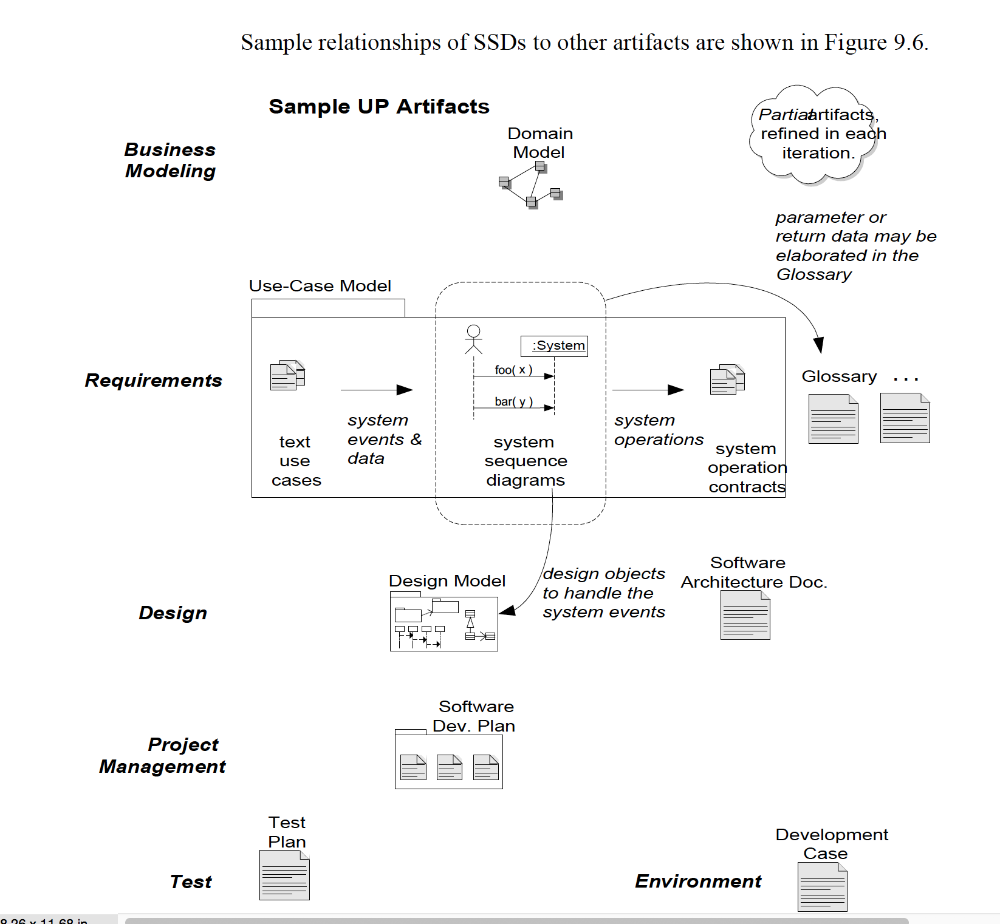

# Casus: Red-cars

## OSM - Modelling

Jorn Brouwer & Wouter Meijer

---

# Aan..

Wij hebben ervoor gekozen om de do

### Toelichting op gemaakte keuzes:

Toelichting op de manier hoe wij de op-te-leveren producten, hebben gerealiseerd:

* Het SRS en SDD bevatten zowel elementen uit iteratie 1 als uit iteratie 2. Dit is een bewuste keuze omdat de gevraagde documenten per iteratie, beschreven in de aangereikte casus, ook niet zo te verdelen zijn.

* We zijn op een aantal punten niet slaafs ingegaan op de gevraagde omschreven opdracht. Maar hebben de afgeweken punten beschreven in: ```LINK```

* In de toelichting van het:
  - [Software Requirements Specification](SRS_v1-0-4.md#overall-description)

  - [Software Design Document](SDD_v1-0-1.md#overall-description)


---

---


